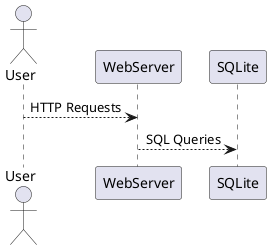

# SPEC-01: Web Forum  

## Background  

This project aims to develop a web-based forum where users can communicate through posts and comments. The forum should support user authentication, post categorization, and a reaction system (likes/dislikes). Additionally, the system must allow filtering of posts based on categories and user activity.  

### Key Technical Constraints  

- **Backend**: Go (Golang)  
- **Database**: SQLite  
- **Frontend**: Plain HTML (no JS frameworks)  
- **Containerization**: Docker  

### Learning Outcomes  

This project serves as a learning experience in:  
- Web development fundamentals (HTML, HTTP, sessions, cookies)  
- SQL database handling using SQLite  
- Encryption techniques (password hashing)  
- Containerization with Docker  

## Requirements  

The web forum must meet the following functional and technical requirements:  

### Must-Have (Mandatory)  
- User authentication (registration & login) using email, username, and password.  
- Store user credentials securely (hashed passwords recommended).  
- Users can create posts and comments.  
- Posts can be categorized.  
- Users can like/dislike posts and comments.  
- Filtering functionality for posts:  
  - By categories (subforums).  
  - By posts created by the logged-in user.  
  - By posts liked by the logged-in user.  
- Guest users (non-registered) can view posts and comments but cannot interact.  
- Session management with cookies (with expiration time).  
- SQLite as the database with at least:  
  - One `SELECT` query.  
  - One `CREATE` query.  
  - One `INSERT` query.  
- Proper HTTP error handling and status codes.  
- Containerized using Docker.  
- Code must follow good practices, including unit tests.  

### Should-Have (Recommended)  
- UUIDs for users and posts for better identification.  
- Encrypted password storage (bcrypt).  

### Could-Have (Optional)  
- A simple admin panel for moderating posts/comments.  
- Support for user avatars (profile pictures).  

### Won't-Have (Out of Scope)  
- No external frontend frameworks (React, Vue, etc.).  
- No real-time chat/messaging.                              - Maybe implemented.
- No advanced analytics or reporting.                       - Maybe implemented.

## Method  

### System Architecture  

The forum follows a **three-layer architecture**:  

1. **Frontend (Presentation Layer)**  
   - Plain HTML with basic CSS for UI.  
   - Uses standard form submissions (no JavaScript frameworks).  

2. **Backend (Application Layer - Go)**  
   - Handles authentication, post management, comments, and filtering.  
   - Uses the `net/http` package to manage routes and requests.  

3. **Database (Data Layer - SQLite)**  
   - Stores users, posts, comments, likes/dislikes, and categories.  
   - Uses `github.com/mattn/go-sqlite3` for SQLite integration in Go.  

**High-Level Component Diagram:**  


### Database Schema  

The forum will use an SQLite database with the following tables:  

#### `users` (Stores user information)  
| Column      | Type         | Constraints                  |  
|------------|-------------|------------------------------|  
| id         | INTEGER     | PRIMARY KEY, AUTOINCREMENT  |  
| email      | TEXT        | UNIQUE, NOT NULL           |  
| username   | TEXT        | UNIQUE, NOT NULL           |  
| password   | TEXT        | NOT NULL (hashed)          |  
| created_at | TIMESTAMP   | DEFAULT CURRENT_TIMESTAMP  |  

#### `posts` (Stores forum posts)  
| Column      | Type        | Constraints                  |  
|------------|------------|------------------------------|  
| id         | INTEGER    | PRIMARY KEY, AUTOINCREMENT  |  
| user_id    | INTEGER    | FOREIGN KEY → users(id)    |  
| title      | TEXT       | NOT NULL                     |  
| content    | TEXT       | NOT NULL                     |  
| created_at | TIMESTAMP  | DEFAULT CURRENT_TIMESTAMP  |  

#### `comments` (Stores comments on posts)  
| Column      | Type        | Constraints                  |  
|------------|------------|------------------------------|  
| id         | INTEGER    | PRIMARY KEY, AUTOINCREMENT  |  
| user_id    | INTEGER    | FOREIGN KEY → users(id)    |  
| post_id    | INTEGER    | FOREIGN KEY → posts(id)    |  
| content    | TEXT       | NOT NULL                     |  
| created_at | TIMESTAMP  | DEFAULT CURRENT_TIMESTAMP  |  

#### `categories` (Stores post categories)  
| Column  | Type     | Constraints                  |  
|---------|---------|------------------------------|  
| id      | INTEGER | PRIMARY KEY, AUTOINCREMENT  |  
| name    | TEXT    | UNIQUE, NOT NULL           |  

#### `post_categories` (Associates posts with categories)  
| Column    | Type     | Constraints                  |  
|-----------|---------|------------------------------|  
| post_id   | INTEGER | FOREIGN KEY → posts(id)    |  
| category_id | INTEGER | FOREIGN KEY → categories(id) |  
| PRIMARY KEY (post_id, category_id) |  

#### `likes_dislikes` (Stores likes and dislikes)  
| Column    | Type     | Constraints                                    |  
|-----------|---------|------------------------------------------------|  
| id        | INTEGER | PRIMARY KEY, AUTOINCREMENT                    |  
| user_id   | INTEGER | FOREIGN KEY → users(id)                      |  
| post_id   | INTEGER | FOREIGN KEY → posts(id), NULLABLE (for comments) |  
| comment_id | INTEGER | FOREIGN KEY → comments(id), NULLABLE (for posts) |  
| type      | INTEGER | CHECK (type IN (1, -1)) (1 = like, -1 = dislike) |  
| created_at | TIMESTAMP | DEFAULT CURRENT_TIMESTAMP                   |  

---
```